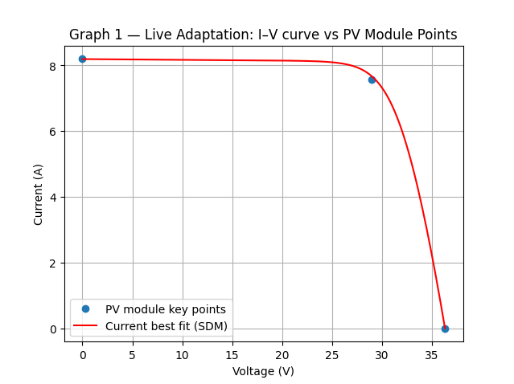
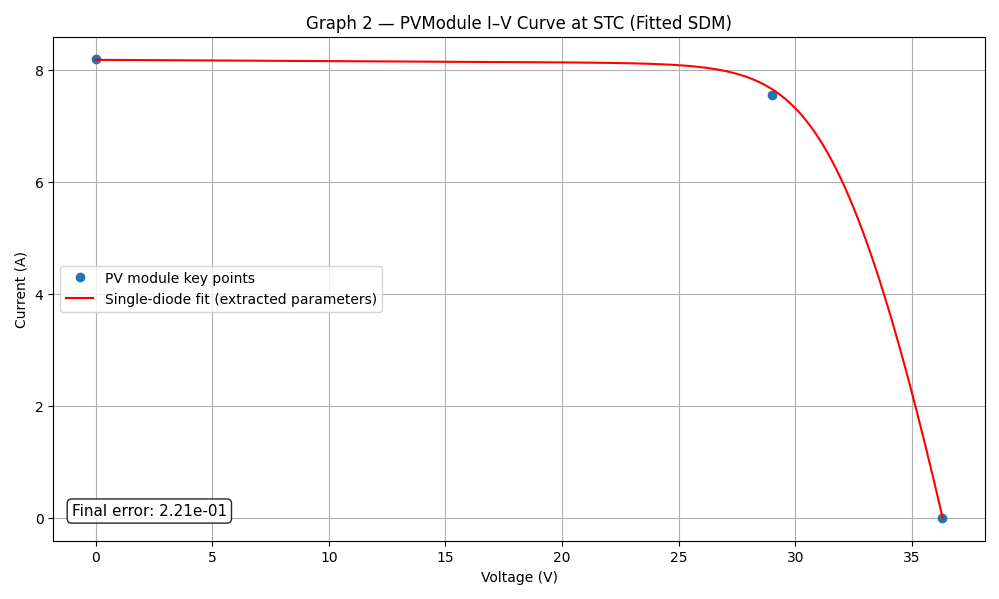

# pvfit5 — Estimation of the Five Parameters of the PV Single-Diode Model

**Version:** 1.1.0 | **Date:** 2026-04-08 | **Author:** Valerio Lo Brano

[](LICENSE)
[](https://pypi.org/project/pvfit5/)
[](https://pypi.org/project/pvfit5/)

**pvfit5** estimates the five parameters of the single-diode model (SDM) of a
photovoltaic module at Standard Test Conditions (STC: 1000 W/m² irradiance,
25 °C cell temperature) using only commercial datasheet values.

A genetic algorithm (DEAP) coupled with the CEC model implementation in
[pvlib](https://pvlib-python.readthedocs.io/) minimises the sum of relative
errors on Voc, Isc, and Pmp, and reconstructs the full I–V curve via the
Lambert W method.

---

## Paper

Lo Brano, V. (2026). *Open and Reproducible Estimation of PV Single-Diode
Parameters from Datasheet Data*. **Energy Reports** (Open Access, CC-BY).

DOI: [10.1016/j.egyr.2026.109280](https://doi.org/10.1016/j.egyr.2026.109280)

See also [`CITATION.cff`](CITATION.cff) for machine-readable citation metadata.

> If you use this software in your research, please cite the article above.

---

## Background

The single-diode model describes the I–V characteristic of a PV cell as:

```
I = I_L - I_0 [exp((V + I·R_s) / (n·N_s·V_th)) - 1] - (V + I·R_s) / R_sh
```

The five unknown parameters to be estimated are:

| Parameter | Symbol | Unit | Description |
|-----------|--------|------|-------------|
| Photocurrent | `I_L_ref` | A | Light-generated current at STC |
| Saturation current | `I_o_ref` | A | Diode reverse saturation current at STC |
| Ideality factor | `a_ref` | — | Modified diode ideality factor (n · N_s · V_th) |
| Series resistance | `R_s` | Ω | Accounts for ohmic losses in contacts and bulk |
| Shunt resistance | `R_sh` | Ω | Accounts for leakage current paths |

These parameters are estimated at **STC** (Standard Test Conditions):
- Irradiance: **1000 W/m²**
- Cell temperature: **25 °C**

---

## Required Inputs

The algorithm needs only the values that appear on a standard PV module
datasheet at STC:

| Input | Symbol | Unit | Description |
|-------|--------|------|-------------|
| Open-circuit voltage | Voc | V | Voltage when no current flows |
| Short-circuit current | Isc | A | Current when terminals are short-circuited |
| Maximum power | Pmax | W | Maximum power at the MPP |
| Voltage at MPP | Vmp | V | Voltage at the maximum power point |
| Current at MPP | Imp | A | Current at the maximum power point |

**Optional inputs** (advanced users):

| Input | Unit | Default | Description |
|-------|------|---------|-------------|
| α_sc (alpha_sc) | A/°C | 0.05 | Short-circuit current temperature coefficient |
| EgRef | eV | 1.121 | Band gap energy at reference (crystalline Si) |
| dEgdT | eV/K | −0.000267 | Temperature coefficient of band gap |

---

## Output

The algorithm returns:

1. **The five SDM parameters** (`I_L_ref`, `I_o_ref`, `a_ref`, `R_s`, `R_sh`)
   at STC, which fully characterise the PV module.
2. **Simulated key points** (Voc, Isc, Vmp, Imp, Pmp from the fitted model)
   compared against the datasheet values.
3. **Total relative error** — the objective function value (lower is better):
   ```
   E = |Voc_sim − Voc*|/Voc* + |Isc_sim − Isc*|/Isc* + |Pmp_sim − Pmp*|/Pmp*
   ```
4. **I–V curve plot** — a publication-quality figure showing the reconstructed
   curve with the datasheet key points annotated.
5. **Summary text file** — `<MODULE_NAME>_CEC.txt` with all parameters and
   errors.

See [`example_output/Gruposolar_GS601456P-218.txt`](example_output/Gruposolar_GS601456P-218.txt)
for a complete text output example.

### Example plots

**Graph 1 — Live adaptation** (updates during GA evolution, auto-closes):



**Graph 2 — Final I–V curve** (publication-quality, stays open):



---

## Requirements

- Python ≥ 3.10
- pip

The following Python packages are required and are installed automatically by
`pip install pvfit5`:

| Package | Min version | Purpose |
|---------|-------------|---------|
| [pvlib](https://pvlib-python.readthedocs.io/) | 0.10 | CEC single-diode model and I–V solver (Lambert W) |
| [DEAP](https://deap.readthedocs.io/) | 1.4 | Genetic algorithm framework |
| [NumPy](https://numpy.org/) | 1.24 | Numerical arrays |
| [Matplotlib](https://matplotlib.org/) | 3.7 | Live and final I–V plots |
| [SciPy](https://scipy.org/) | 1.10 | Statistical analysis |
| [pandas](https://pandas.pydata.org/) | 2.0 | Dataframe handling and Excel I/O |
| [openpyxl](https://openpyxl.readthedocs.io/) | 3.1 | Excel reading (.xlsx) |
| [XlsxWriter](https://xlsxwriter.readthedocs.io/) | 3.1 | Excel writing (.xlsx) |
| [seaborn](https://seaborn.pydata.org/) | 0.12 | Statistical plots (batch analysis) |
| [tqdm](https://tqdm.github.io/) | 4.60 | Progress bar for the GA evolution |

---

## Installation

### Using pip

**From PyPI:**
```bash
pip install pvfit5
```

**From GitHub (latest development version):**
```bash
pip install git+https://github.com/valeriolobrano/pvfit5.git
```

**For local development (editable install):**
```bash
git clone https://github.com/valeriolobrano/pvfit5.git
cd pvfit5
pip install -e .
```

### Using uv

[uv](https://docs.astral.sh/uv/) is a fast Python package manager that can
replace pip and virtualenv.

**Add to an existing project:**
```bash
uv add pvfit5
```

**From GitHub:**
```bash
uv add git+https://github.com/valeriolobrano/pvfit5.git
```

**Run directly without installing (ephemeral):**
```bash
uvx --from pvfit5 pvfit5 \
    --voc 36.3 --isc 8.19 --pmax 218.95 --vmp 29.0 --imp 7.55
```

**Create a new project with pvfit5:**
```bash
uv init my_pv_project
cd my_pv_project
uv add pvfit5
uv run pvfit5 --voc 36.3 --isc 8.19 --pmax 218.95 --vmp 29.0 --imp 7.55
```

---

## Usage

### Command line

After installing pvfit5, run it from the terminal with your module datasheet
values:

```bash
pvfit5 --voc 36.3 --isc 8.19 --pmax 218.95 --vmp 29.0 --imp 7.55
```

All five datasheet values are required. Optional arguments:

| Argument | Description | Default |
|----------|-------------|---------|
| `--name` | Module name (for output files) | `PVModule` |
| `--error-target` | GA early-stop threshold | `1e-2` |
| `--alpha-sc` | α_sc in absolute units (A/°C) | `0.05` |
| `--alpha-sc-rel` | α_sc in relative units (1/°C); overrides `--alpha-sc` | — |
| `--egref` | Band gap energy at reference conditions (eV) | `1.121` |
| `--degdt` | Temperature coefficient of band gap (eV/K) | `-0.000267` |
| `--no-plot` | Disable live and final plots | — |

**Full example:**

```bash
pvfit5 --voc 36.3 --isc 8.19 --pmax 218.95 --vmp 29.0 --imp 7.55 \
       --alpha-sc 0.05 --egref 1.121 --name MyModule
```

### Python library

```python
from pvfit5.find_pv_parameters import fit_parameters, PVModuleData, STC, GAConfig

nd  = PVModuleData(voc=36.3, isc=8.19, pmax=218.95, vmp=29.0, imp=7.55)
stc = STC()                       # default: EgRef=1.121, dEgdT=-0.000267
ga  = GAConfig(error_target=1e-2)

results, summary = fit_parameters(nd, stc, ga, module_name="MyModule")
print(summary)

# Access individual results
print("R_s  =", results["best_individual"]["R_s"], "Ω")
print("R_sh =", results["best_individual"]["R_sh"], "Ω")
```

### Plots

The script opens two plots:
- **Graph 1** (live): I–V curve updating during GA evolution (auto-closes after
  3 s).
- **Graph 2** (final): publication-quality I–V curve with annotated errors
  (stays open). Use `--no-plot` to suppress both.

---

## Batch Validation (optional)

Run the algorithm on a large set of modules from the pvlib CEC database:

```bash
# Analyse 100 modules in alphabetical order
pvfit5-batch -n 100 --selection alpha

# Analyse 200 random modules (reproducible with --seed)
pvfit5-batch -n 200 --selection random --seed 42 --output my_results.xlsx
```

Results are saved to an Excel file. Run `pvfit5-batch --help` for all options.

---

## Analysing Batch Results (optional)

After running `pvfit5-batch`, analyse the output Excel file:

```bash
# Analyse the default output file
pvfit5-analysis

# Analyse a specific file
pvfit5-analysis my_results.xlsx

# Suppress figure output
pvfit5-analysis my_results.xlsx --no-figures
```

The script produces:
- PDF and CDF plots for RMSE and runtime.
- Dominance analysis of partial errors.
- `results_summary.xlsx` with descriptive statistics.

For per-technology statistics:

```bash
pvfit5-parametric

# Or with a specific input and output file
pvfit5-parametric my_results.xlsx --output my_statistics.xlsx
```

---

## License

Released under the [BSD-3-Clause License](LICENSE). Free to use, modify, and
redistribute, provided the original copyright notice is retained. The software
is provided **without warranty of any kind**.
